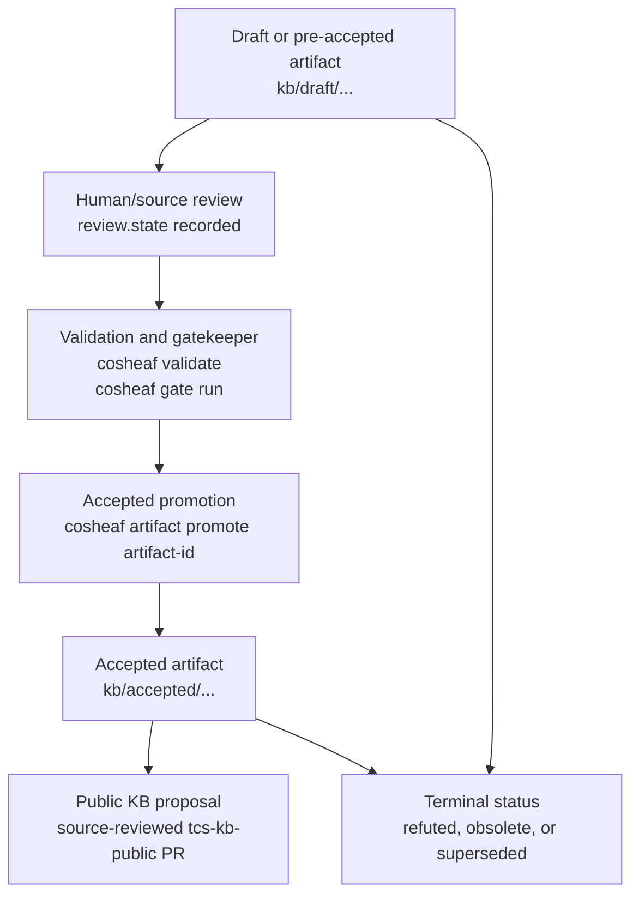

# Artifact Lifecycle

This document is a single overview of the artifact lifecycle. It summarizes
existing workflow semantics only; it does not change accepted-promotion policy.

## Lifecycle Diagram



## Status And Path Rules

Draft or pre-accepted artifacts live under lifecycle draft paths such as
`kb/draft/<type-dir>/<artifact-id>.yaml`. Accepted artifacts live under
`kb/accepted/<type-dir>/<artifact-id>.yaml` relative to the active KB root.
Configured workspaces evaluate these paths relative to each KB root, so
`kb/private/accepted/...` and `kb/public/accepted/...` are both accepted areas
inside their own roots.

Terminal statuses such as `refuted`, `obsolete`, and `superseded` are not
current accepted knowledge. They remain useful as known failures or historical
records when context packs or reviews need them.

## Promotion Boundary

Accepted knowledge is introduced only through:

```bash
cosheaf artifact promote <artifact-id>
```

Promotion validates the repository, runs the gatekeeper, checks dependencies,
checks target verifier outcomes, requires human review state, refuses readonly
KB roots, and writes deterministic YAML into the accepted area. Direct accepted
creation and direct `cosheaf artifact move-status <artifact-id> accepted` are
intentionally refused.

## Draft Proposal Boundary

`cosheaf workflow draft-proposal` may write review-context proposal JSON or a
draft claim artifact under a writable private draft root. This command does not
create source metadata, human review, verifier pass, gate pass, accepted
status, accepted refutation, or promotion authority. It refuses accepted KB
targets and public or readonly KB targets.

Draft proposal output is an input to ordinary review. It must still go through
source review, validation, gatekeeper checks, explicit human review, and
`cosheaf artifact promote <artifact-id>` before it can become accepted
knowledge.

## Public KB Boundary

Public KB promotion is a repository workflow, not a new lifecycle status. A
workspace-private artifact that becomes reusable public knowledge should be
proposed to `tcs-kb-public` through a focused issue and pull request with
source metadata, validation, gatekeeper output, and human review. Downstream
workspaces should mount the public KB readonly.

Public artifacts must not depend on private artifacts. Accepted artifacts must
not depend on draft or otherwise pre-accepted artifacts, even across KB roots.
