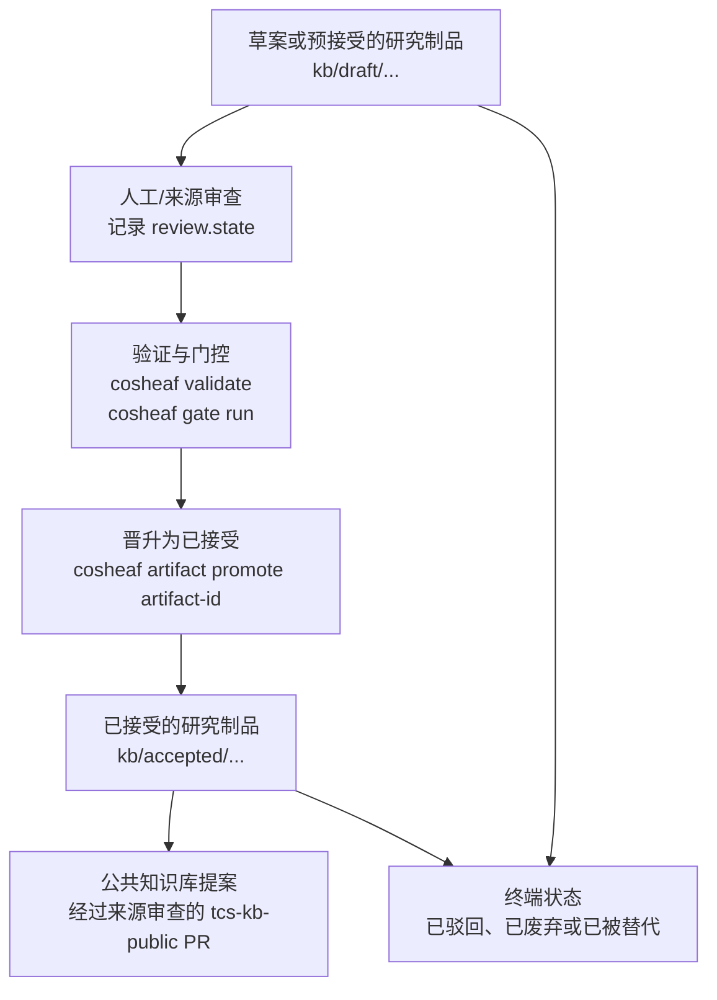

[中文版](ARTIFACT_LIFECYCLE.zh-CN.md) | [English](ARTIFACT_LIFECYCLE.md)

# 研究制品生命周期 (Artifact Lifecycle)

本文档是关于研究制品生命周期的统一概述。它仅总结现有的工作流语义，不改变“已接受 (accepted)”晋升策略。

## 生命周期图表



## 状态与路径规则

草案或预接受的研究制品存放在生命周期草案路径下，例如 `kb/draft/<type-dir>/<artifact-id>.yaml`。已接受的研究制品存放在相对于活跃知识库 (KB) 根目录的 `kb/accepted/<type-dir>/<artifact-id>.yaml` 下。已配置的工作区会相对于各个 KB 根目录评估这些路径，因此 `kb/private/accepted/...` 和 `kb/public/accepted/...` 都是它们各自根目录内的“已接受”区域。

如 `refuted` (已驳回)、`obsolete` (已废弃) 和 `superseded` (已被替代) 等终端状态不属于当前的已接受知识。但当上下文包 (context packs) 或审查需要时，它们作为已知的失败案例或历史记录依然有用。

## 晋升边界

已接受知识仅能通过以下方式引入：

```bash
cosheaf artifact promote <artifact-id>
```

晋升操作会验证代码库、运行门控 (gatekeeper)、检查依赖、检查目标验证器的结果、要求存在人工审查状态、拒绝只读的 KB 根目录，并将确定性的 YAML 写入“已接受”区域。系统有意拒绝直接创建处于已接受状态的制品以及直接执行 `cosheaf artifact move-status <artifact-id> accepted`。

## 公共知识库边界

公共知识库晋升是一种代码库工作流，而不是一种新的生命周期状态。如果工作区私有的研究制品成为了可复用的公共知识，应通过专门的 Issue 和 Pull Request 向 `tcs-kb-public` 提出提案，并附上来源元数据、验证结果、门控输出以及人工审查记录。下游工作区应以只读方式挂载该公共知识库。

公共制品不得依赖私有制品。已接受的研究制品不得依赖草案或其他处于预接受状态的制品，即使是跨知识库根目录的依赖也是被禁止的。